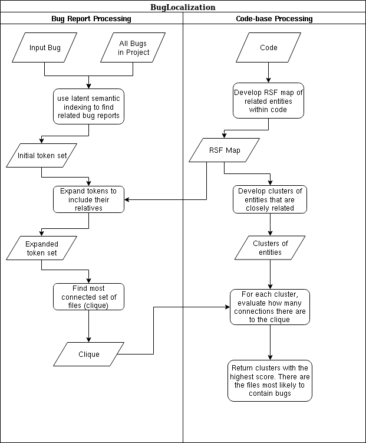

# Introduction 

### Problem description

Most professional developers and software engineers have run into a situation
where they are presented with a bug, issue, or ticket and do not know where to
begin looking for the cause of the problem. This usually leads the developer 
into a long series of bruteforce debugging where they explore all possible paths
leading up to the symptoms hoping they will run into something suspicious.

In an attempt to reduce this mindless guessing and time wasted for the
developer, the research of fault localization is used to programmatically
understand where the error could be coming from. The project we are working
with is capable of creating a list of files that are most likely to have the
bug within them.

### Focus

Our focus will be to take that project and streamline the process so it is
easier for an average developer to pickup and plug into their project to help
their workflow. We will be creating a Software as a Service(SaaS) using the
concept of the BugLocalization project that Professor Kontogainnis has
organized in the past. 

### Key results

We were able to significantly improve the existing codebases and reduce a large
amount of complexity from the processing. This allowed us to easily plug the code
into an API that we created. The API issues from a Github repository and then
initiates a modified version of the BugLocalization process.

### Significance

This work is very significant as it has the opportunity to be the first easily
pluggable fault localization software that can be used without extensive
resources. We hope in the future this service would be used as commonly as
other CI tools like Travis.

### Report Structure

The report will first cover terms needed to understand the report, then some
background information about the algorithm and process used inside
BugLocalization and finally the objectives, strategy and results of our
development

# Concepts, Terms, Definitions, Equations

### RSF
An RSF is a map of relationships betweens tokens within a codebase, where
a token is a keyword in the codebase such as a method. It is generated using
preprocessing scripts, and the result allows us to verify tokens inside of bug
reports.

### Bug Report
A database entry for each bug report used for the analysis. Each bug report
contains a String field containing what a user wrote inside their bug report.

### Token Expansion
Tokens extracted from the bug report are expanded to find other similar tokens.
Token expansion includes tokens that are referenced by the original token set.

### Clique

A collection of tokens that are referenced the most within the expanded set of tokens

### Cluster
A group of relationships that are closely related to each other

# Background and Related Work

The main purpose of this project is to assist in locating faults so developers
can isolate errors quicker. There are three main categories of fault localization:
static-analysis/test-case based approach, machine learning based approach, and
a type based approach. The method that we are expanding upon falls into the first
category with an approach that heavily relies on preforming static analysis on the 
code and bug texts.


This project was conceived from research that Professor Kontogainnis had
completed with past students regarding the task of determining faults in
a large codebase using only past bug reports. Past students had experimented
with multiple algorithms for processing large amounts of bug reports in order
to come up with an index of files that are most likely to have a new bug
within them. 


The project operated in many phases. Each one containing one very specific
task. The first phase involved extracting bug reports from a repository and
parsing them through a reader into an object model that allowed easier
processing. The second phase handled pulling the source code of the project and
generating tokens. Tokens can be entities in the codebase but for our specific
use they are method names that are later lifted up to filenames. A map of these
tokens is created and then using the results from phase 1 and 2, the next piece
of software is ready to make a connection between these two datasets. In phase
3 each of the tokens extracted from the bug report are verified and expanded to
generate a set of tokens that include all relatives to each token. A token's
relative is defined as a token that makes a call to or from the original token.


The first three phases mostly involved preprocessing different datasets into
a form that would be ideal for making a conclusion. At this point we have
a large set of entities that we suspect are vaguely related to the bug report
we want to process. Phase 4 is where we begin making conclusions on the data.
The software chooses between two algorithms for determining the score that will
indicate the faulty files. If the amount of files associated with the bug are
less than 15% of the total system files, we choose the simpler algorithm and
find the score by determining which files have the most outward connections to
the codebase. If the bug effects more than 15% of total files, we generate
clusters of related entities using our relationship map produced in phase 2 and
then for each cluster we check how connected it is to the most important files
related to our bug. The cluster that is most connected has the highest chance
of containing the bug.[@Fault, @EMSE]


The original system consisted of a collection of scripts written in Java,
Python and Shell. The scripts were fairly distributed and had very little
documentation. Most of the work was done in intermediate steps and did
not fit well together as a system because too much user intervention was
required between steps.

```{r, out.width = "500px", echo=FALSE}

```

# Development Objectives 

The focus will be to design and develop a system that is capable of processing
bug reports and extracting useful information about them, and then using that
information to provide the developers useful insight into where the bug may be
within a large code base. The goal is to reduce the amount of time a developer
will need to reach the correct bug after initially reviewing the bug report.

The system will be developed in such a way that it is easily integrated into
a continuous delivery pipeline. The project can be divided into three distinct
components.

### Data Processing (O1)
In order for the entire system to work correctly the core essential data
processing and analysis has to be effective in detecting the errors. Therefore,
the first step is developing a system that can use NLP to process all the bug
reports associated with a project to come up with a list of keywords and
process the code base to determine a map of relationships between function
calls. This code has now been written and is mostly within our project.

### User Interface (O2)
The next step in delivering the system to a real user, is developing a front
end where a user can input a repository for the system to begin processing.
Ideal operation of this tool would occur like other DevOps pipeline tools such
as travis-ci.org where a user can link a repository they own and the tool can push
it's results back into the bug report for developers to see. There will not be
too many interactions available on the front end other than viewing the results
of the system and picking new repositories. This portion of the project is not
yet completed. Refer to deviations section to understand the reasoning for
putting the interface as the last priority.

### Runtime Processing (O3)
Since the front end will be making REST API calls to Github repositories, and
we need a way to persist processing while providing consistent feedback to
users, there needs to be a backend API service allowing those operations to
occur. Another task this portion will be responsible for is handling the flow
of information when a new bug report appears. The backend will be responsible
for detecting this, starting a new processing task, and posting a "Fault
Report" back into the bug discussion. A substantial amount of work has been
done on this portion of the project. The backend is able to communicate with
Github and catch issues posted by users.

# System Requirements 

### Section A : Data Processing

- **Feature 1:** Able to generate entity relationship rsf from codebase
  - FR 1: Pass code through cdif2rsf to generate rsf
  - FR 2: Clean up incorrect entity and relationships
  - FR 3: Store in accessible data storage for next step to use

- **Feature 2:**  Able to generate set of keywords from bug description
  - FR 1: Compare each token to codebase to find valid functions
  - FR 2: Expand initial token set by a factor of 3
  - FR 3: Use NLP to determine question context 

- **Feature 3:** Able to combine keywords and rsf into ranked outcomes
  - FR 1: Run LSI on each token and generate search space for each
  - FR 2: Expand the search space for each result in FR 1
  - FR 3: Find similarities between the initial token expansion and the final
    set of tokens
  - FR 4: Apply ranking equation from research paper to come up with final
    outcome

### Section B : Front-End User Interface

- **Feature 4:**  User is able to scan and mark a new repository for processing
  - FR 1: Scan user's Github repos using Github's API
  - FR 2: Allow the user to select ones they wish to run processing on
  - FR 3: Remember which ones the user selected by storing on backend

- **Feature 5:**  User is able to view the results of a new bug report's processing
  - FR 1: Monitor output from backend endpoints showing new results for user's repos
  - FR 2: When a new bug report is created, and the processing finishes, show
    the output of that processing on a separate page
  - FR 3: Allow the user to rerun processing on a specific bug report by
    sending a request to backend

- **Feature 6:**  User is able to login using their Github credentials
  - FR 1: On first usage redirect user to Github's App authentication page
  - FR 2: Ask backend to associate bug reports and repositories with this user
  - FR 3: Redirect user to main UI

### Section C : Back-End Runtime Processing

- **Feature 7:** Support front-end operations
  - FR 1: Allow registration using Github Auth
  - FR 2: Allow retrieval of processing results for each bug report
  - FR 3: Support re-running processing on a specific bug report
  - FR 4: Create a API where the UI can fetch everything from

- **Feature 8:** Manage the automation of Data Processing (F1, F2, and F3)
  - FR 1: Automate RSF generation when a new repository is linked
  - FR 2: Automate keyword generation when a new repository is linked
  - FR 3: Continuously improve and modify RSF and keywords as code/bugs change

- **Feature 9:** Handle processing and evaluation when a new bug report comes in
  - FR 1: Monitor marked repositories for each registered user and trigger when new issue is filed
  - FR 2: Run through automated ranking algorithm 
  - FR 3: Store result for later retrieval
  - FR 4: Be able to connect to a repository and fetch an issue when it is posted

- **Feature 10:** Combine each element of data processing into the backend runtime
  - FR 1: Combine entity generation into token generation
  - FR 2: Combine FR1 with RSF processing all into one unit
  - FR 3: Move all functionality to an exposed part of the API
  - FR 4: Create all endpoints for data processing functionality

# Development Strategy 

Since this project had many parts of it already implemented, just in poor
condition, we did not have many choices over what development tools and
languages to use. The majority of the project was written in Java, with some
separate Python scripts used for data manipulation at some of the stages in the
system. 

Since we started the API from scratch, we had more choices on
technologies and tools in that section. The API was written in Kotlin because
it allowed us to have easy access to the Java code since it is still a JVM
language but also provide higher level functionality and cleaner syntax to
speed up development. The API is supported by MongoDB for storing data from
Github issues and the future UI.

Git and Github were used for collaboration between the two developers and 
ngrok was used to host the services. Another tool that really helped our
development strategy was Robo3t as it allowed us to monitor the MongoDB 
for incoming objects and see them in realtime.

All the datasets we used for our processing came from BugZilla as that was the
only platform supported by the preexisting preprocessing scripts. The project
repositories we accessed were amarok, konjueror, k3b, and kopete.

### Technologies

- Kotlin
- Python
- Java
- Javalin
- MongoDB
- Github Webhooks

### Tools

- Intellij Idea
- NeoVim
- Robo3T
- ngrok
- Git
- Github

### Datasets
- BugZilla bug reports
   - amarok repository
   - Konqueror repository
   - k3b repository
   - kopete repository

# Results 

### BugLocalization Project

- Restructured and cleaned up codebase
- Reduced very large codebase to 10 files 
- Documented and made more readable for easier integration 
- Cleaned up data flow to allow easier integration with API

The BugLocalization project has been completely revamped to work better with
the API design. A large amount of redundant code has been removed and only the
essential functionality exists. Everything has been commented and documented for 
easier maintainability and modularity.

This project produces two types of output depending on the input and which
algorithm is chosen for processing the token scoring. Figures 4 and 5 show you
examples of each type of output figure 4 shows the results received when you
run BugLocalization with a small bug and a simple algorithm is chosen. Figure
5 shows the results when you run BugLocalization with a large bug and make use
of the complex ranking algorithm.

### API

- Able to monitor a GitHub repo for events
- Detect new issues and add into a Mongo database
- Able to start and end deployments on Pull Requests

The API was started from scratch and has progressed into something that can be
relied on to fetch and process incoming bug reports and support a future UI.
Currently the API is able to catch incoming Github webhooks and take repository
information from the HTTP request. Using this information and the object model
of the repository it can create an entry in the database to represent it. 
When new issues come in they are added to the object model inside the database
and when processing begins it can read that model from the database.

The results produced by the API are visible inside the object model of the database.
This model populated with some dummy issues can be seen in the Robo3t screenshot
in figure 6

\newpage

```{r, out.width = "500px", echo=FALSE}

```
_Figure 2_

```{r, out.width = "500px", echo=FALSE}

```
_Figure 3_

```{r, out.width = "500px", echo=FALSE}

```
_Figure 4_

```{r, out.width = "500px", echo=FALSE}

```
_Figure 5_

```{r, out.width = "400px", echo=FALSE}

```
_Figure 6_

# Discussion 

### Threats to the validity of the results

Due to the large amount of bug reports and the possibility of having reports
without enough details, the results are not guaranteed to find where the fault
occurs. The ranking used in the system is useful in mitigating incorrect
results, but does not ensure that any of the results will be useful in
determining the cause of fault in the software. A lot of other methods used to
minimize the threats to validity were already implemented in the project, but
it was mentioned that using different algorithms would allow us to compare the
accuracy of different methods.

### Implications of the results

One of the original goals of this project was to implement another algorithm
for determining the cause of fault to then use to compare the validity of the
results for both algorithms. The validity of the results is important for
a system like this because of how flexible it is for testing on software
projects. The system would be language agnostic and allow the user to be able
to accurately detect specific points of faults in software projects that use
multiple languages. This is much more useful than traditional tools used for
detecting issues in software and would be applicable to any project, where
those that have large projects and/or use multiple languages would benefit the
most. This system would save software engineers lots of time and effort wasted
on debugging issues with software systems that don't provide enough information
about where a fault in the program occurs.

### Limitations of the results

The main limitation to this project is the complexity of being able to detect
a fault based on reports alone. When developing, users have many methods of
getting feedback through logs and error detection that are not available to our
system. The best way to remove this limitation would be to get more details
from failure reports, but unfortunately there are not many alternatives that
offer nearly as many reports as BugZilla.

# Conclusions 

Unfortunately, for our project we had some communication problems for a large
portion of the year. We ended up getting a late start to the project and had to
re-purpose the project after the second milestone. Due to our late start and
a couple missing scripts, we did not have access to all parts of the system
needed to create a complete system and did not have enough time to create
a standalone service with a UI. The implications of creating a complete system
would mean that the computer running the system would have to be powerful
enough to process all parts of the analysis within a reasonable amount of time
in order to be of use to the programmer. Based on our testing with the
components we had, we believe that this would be achievable if given access to
the remaining parts of the program. We were able to refactor the code and
greatly improve the structure and readability. The main method contained too
much of the logic of the system, so modularizing the code and adding comments
made it much easier to understand for others who will look at the code.

Completing O2 added the ability to connect to GitHub using their API and get
issues from their tracker. Since the biggest change to the existing system is
the report data used, the main structure of the system remains the same while
allowing it to be used in another useful domain. Using this system in GitHub
allows developers to easily discover faults in their applications. The system
is set to be run whenever an issue was added by a user and would notify the
repo owner.

# Future Work and Lessons Learnt 

### Future work

For further development, we would want to develop software to process issues
incrementally into the BugLocalization. We would then integrate the
BugLocalization project as part of the API and utilize its full power. Since we
did not manage to complete O3, we would also want to make a web UI similar to
Travis to display results.

### Lessons learnt

We have learned from this project how important it is to develop consistent
communication plan with stakeholders. At many times during this project, we
went long periods of time without meeting to discuss how our progress is going.
This created some problems because we were unsure of how to run the program
initially and had to email a grad student to get some of the missing files.
Getting email responses took longer than in person, so having more consistency
to meet and discuss problems in person would have been beneficial.

\newpage

#References
